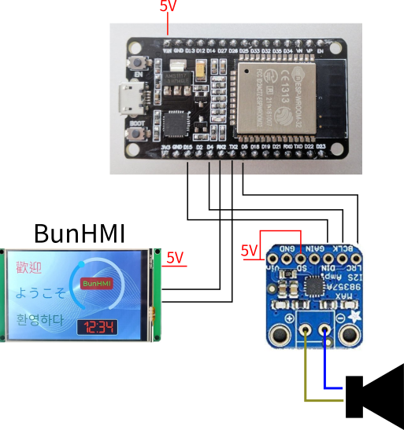

# BunHMI_esp32_audio_player
Audio player by using https://github.com/schreibfaul1/ESP32-audioI2S and [BunHMI](https://shop.mcuidea.com/) display

Feature list
* Stream MP3 from web server to i2s audio amplifier.
* GUI control interface by using BunHMI display.
* Select MP3 by rolling bar.
* Select Next and Prev
* Volume control
* Disp id3data of MP3 on display.

**Psuse** function works only for local file playing(from SD Card), so it is't work for streaming.

## Audio output
This project using MAX98357A as audio output. which only has single channel output. You can add another channel to achieve sterio output easily. Please refer MAX98357A datasheet.

## Schematic
Here is the schematic, which only using few signal wires.

## BunHMI

The "BunHMI" folder includes the BunMaker project. you can open by BunMaker: https://shop.mcuidea.com/bunmaker

## ESP32 code
 The "AudioPlayer" folder includes esp32 arduino source code.

