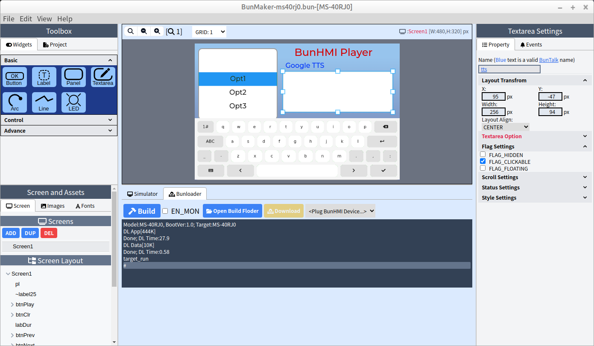

# BunHMI_esp32_audio_player
Audio player by using https://github.com/schreibfaul1/ESP32-audioI2S and [BunHMI](https://shop.mcuidea.com/) display

## BunHMI

The "BunHMI" folder includes the BunMaker project. you can open by BunMaker: https://shop.mcuidea.com/bunmaker

## ESP32 code
 The "AudioPlayer" folder includes esp32 arduino source code.

